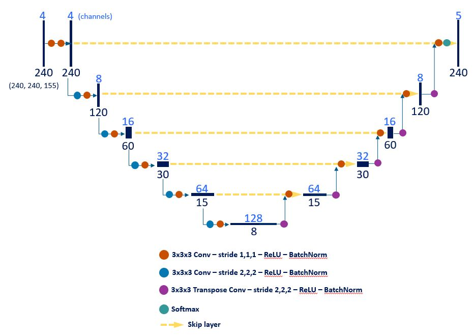
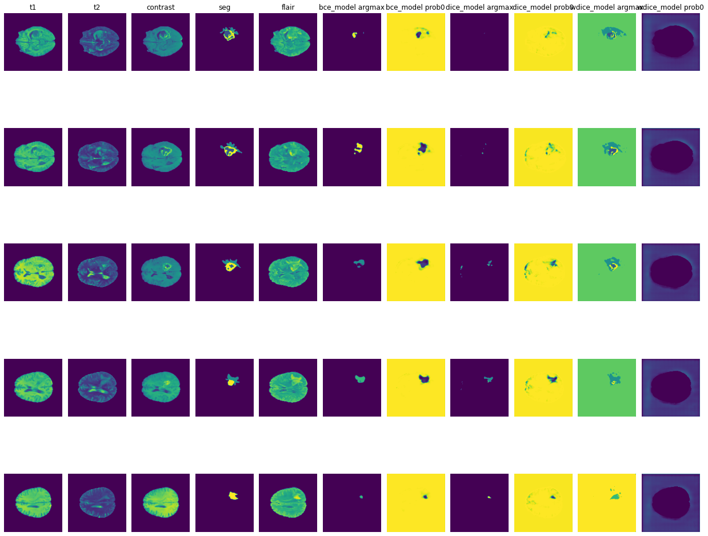

# Brain Tumor Image Segmentation

## Abstract
The purpose of our project is to use computer vision algorithms to detect and segment a specific type of brain tumor – glioblastoma multiforme (GBM) – on clinical 3D MRI data. We used a dataset collected and labelled by the Radiological Society of North America (RSNA) Brain Tumor Segmentation (BraTS) Challenge 2021, which included 1251 cases. We split these into 747 training samples, 244 validation samples, and 258 test samples. Each case represents a patient with a known glioblastoma multiforme and contains four MRI sequences that each provide different information about the anatomical situation in the brain and the tumor. A fifth dataset for each patient contains the ground truth segmentation from the RSNA. We trained three U-nets with different loss functions (cross-entropy, dice and weighted dice) to segment the healthy brain tissue and the different tumor regions using google colab pro with one GPU. We were able to implement a deep learning algorithm that reasonably identified the healthy tissue, the affected brain tissue (edema zone), the enhancing tumoral rim, and the tumor core with dice similarity scores up to 80.5%. Our computer vision project was a success in segmenting glioblastoma multiforme from clinical MRI scans, though further refinement might be achieved with more GPU and implementation of transfer learning. 

## Requirements
The code was tested on:
- matplotlib 3.2.2
- numpy 1.21.5
- nibabel 3.0.2
- tensorflow 2.8.0
- python 3.7.13
- pickle 4.0

## Instruction

### Prepocessing 
We used Deep Learning Methods specialized in the class of problems known as Semantic image Segmentation. In semantic segmentation, the goal is to classify each voxel (3D pixel) in the input image. We segmented each voxel in the MRI scan to be either gadolinium-enhancing tumor (ET — label 4), the edematous/invaded tissue (ED — label 2), the necrotic tumor core (NCR — label 1), and any tissue not belonging to the previous three, which is unaffected brain tissue (label 0). 

Unfortuantely, the dataset is not publicly available but we do provide a sample in `.00_source/train`. The original images had a shape of 240x240x155. The labels/ground truth can be found in `.00_source/labels` We also provide ways to read the dataset. To learn more about it, please check `.10_code/explore.ipynb`. 

During data processing, we also tried moving data from Google Drive to Google Cloud Storage. We did this because we tried implemnting distributed model training (using TPUStrategy API by tensorflow framework) to accommodate for expensive computation.  While we could not successfully leverage Google Colab Pro for TPUStrategy API, we do provide `.10_code/transfer_google_drive_to_GCS.ipynb` for you to replicate the work provided you use Colab Pro plus.

### Training
Once your MRI has been preprocessed, the next step is to obtain a good initialization for the encoder. We used U-Net deep learning model in this problem. This resembles an encoder-decoder network where the first half of the network is a series of convolutional layers that decrease the size of the image after each layer while increasing the number of channels, culminating into a single dense layer composed of many channels and 1 pixel (22, 23). The second half of the network converts this dense layer back to an image of the dimension as that of the input image, but with the number of channels equal to the number of possible output classes. Thus, the final output represents the probabilities of each voxel belonging to each of the classes. Since we cannot expect the encoder-decoder mechanism to accurately form borders at the fine grained voxel-level, we add skip layer connections connecting across the “U” to guide the formation of voxel-level outputs (24-26).

We train the dataset with U-net model using three different loss functions - 
* Cross Entroy `10_code/Modeling_2.ipynb` 
* Dice `.10_code/Modeling_3_DICE.ipynb`
* Weighted Dice loss `.10_code/Modeling_7_wDICE.ipynb`

We also tried AutoEncoder as Transfer Learning process to help us transfer the 4 channels, which are our 4 MRI image datasets (T1, T2, T1-contrast, T2-FLAIR) into more representative features for the second half on the neutral network to provide more accurate segmentation results. However, we encountered overfitting issues and found that the validation loss was a lot higher than we expected. Thus, we tentatively considered this as future work and returned to the evaluation of the U-Net model. We also provide `.10_code/auto_encoder.ipynb` file for anyone to get started with fine tuning auto encoder model for image segmentation.

### Evaluation
We evaluated the performance of our model using the same methods as the BraTS challenge applies to the submissions that they receive which is the Dice Similarity Coefficient, cross-entropy for each of the 4 labels.

The cross-entropy loss (bce-argmax) model partially detected the contrast enhancing tumor zone (blue) and correctly classified the healthy tissue (purple). All models correctly detected the healthy tissue (label 0, labeled with _prob0) but the dice model detected less of the normal anatomy as abnormal. The dice and weighted dice models (dice-argmax and wdice_model-argmax) performed well at detecting the enhancing tumor (yellow), the necrosis zone (dark blue) and the edema zone (light blue), as well as the healthy tissue (purple). They mostly match the ground truth segmentation.

# Demo Link
[Demo](https://tinyurl.com/444f59pw)

## Contact
Feel free to open an issue in github for any problems or questions.

## References
[1] Pereira S, Pinto A, Alves V, Silva CA. Brain Tumor Segmentation Using Convolutional Neural Networks in MRI Images. IEEE Transactions on Medical Imaging. 2016;35(5):1240-51.

[2] Wu W, Klockow JL, Zhang M, Lafortune F, Chang E, Jin L, et al. Glioblastoma multiforme (GBM): An overview of current therapies and mechanisms of resistance. Pharmacological Research. 2021;171:105780.

[3] Oszvald A, Güresir E, Setzer M, Vatter H, Senft C, Seifert V, et al. Glioblastoma therapy in the elderly and the importance of the extent of resection regardless of age. J Neurosurg. 2012;116(2):357-64.

[4] Davis ME. Glioblastoma: Overview of Disease and Treatment. Clin J Oncol Nurs. 2016;20(5 Suppl):S2-8.

[5] Lee E, Ahn K, Lee E, Lee Y, Kim D. Potential role of advanced MRI techniques for the peritumoural region in differentiating glioblastoma multiforme and solitary metastatic lesions. Clinical radiology. 2013;68(12):e689-e97.

[6] Gahramanov S, Varallyay C, Tyson RM, Lacy C, Fu R, Netto JP, et al. Diagnosis of pseudoprogression using MRI perfusion in patients with glioblastoma multiforme may predict improved survival. CNS oncology. 2014;3(6):389-400.

[7] Batash R, Asna N, Schaffer P, Francis N, Schaffer M. Glioblastoma multiforme, diagnosis and treatment; recent literature review. Current medicinal chemistry. 2017;24(27):3002-9.

[8] Radiopaedia. MRI sequences (overview) 2022 [Available from: https://radiopaedia.org/articles/mri-sequences-overview.

[9] Lacroix M, Abi-Said D, Fourney DR, Gokaslan ZL, Shi W, DeMonte F, et al. A multivariate analysis of 416 patients with glioblastoma multiforme: prognosis, extent of resection, and survival. J Neurosurg. 2001;95(2):190-8.

[10] Barone DG, Lawrie TA, Hart MG. Image guided surgery for the resection of brain tumours. Cochrane Database Syst Rev. 2014;2014(1):Cd009685.

[11] Krupinski EA. Current perspectives in medical image perception. Atten Percept Psychophys. 2010;72(5):1205-17.

[12] Mascagni P, Longo F, Barberio M, Seeliger B, Agnus V, Saccomandi P, et al. New intraoperative imaging technologies: Innovating the surgeon's eye toward surgical precision. J Surg Oncol. 2018;118(2):265-82.

[13] Hammoud MA, Sawaya R, Shi W, Thall PF, Leeds NE. Prognostic significance of preoperative MRI scans in glioblastoma multiforme. Journal of neuro-oncology. 1996;27(1):65-73.

[14] Mehta AI, Kanaly CW, Friedman AH, Bigner DD, Sampson JH. Monitoring radiographic brain tumor progression. Toxins. 2011;3(3):191-200.

[15] Kalpathy-Cramer J, Gerstner ER, Emblem KE, Andronesi OC, Rosen B. Advanced magnetic resonance imaging of the physical processes in human glioblastoma. Cancer research. 2014;74(17):4622-37.

[16] America RSoN. Brain Tumor Segmentation Challenge 2021: RSNA; 2021 [Available from: https://www.rsna.org/education/ai-resources-and-training/ai-image-challenge/brain-tumor-ai-challenge-2021.

[17] Bitar R, Leung G, Perng R, Tadros S, Moody AR, Sarrazin J, et al. MR Pulse Sequences: What Every Radiologist Wants to Know but Is Afraid to Ask. RadioGraphics. 2006;26(2):513-37.

[18] Jordan J. Semantic Segmentation 2022 [Available from: https://www.jeremyjordan.me/semantic-segmentation/

[19] Matcha CN. A 2021 Guide to Semantic Segmentation 2021 [Available from: https://nanonets.com/blog/semantic-image-segmentation-2020/.

[20] Wang P, Chen P, Yuan Y, Liu D, Huang Z, Hou X, et al., editors. Understanding Convolution for Semantic Segmentation. 2018 IEEE Winter Conference on Applications of Computer Vision (WACV); 2018 12-15 March 2018.

[21] Garcia-Garcia A, Orts-Escolano S, Oprea S, Villena-Martinez V, Garcia-Rodriguez J. A review on deep learning techniques applied to semantic segmentation. arXiv preprint arXiv:170406857. 2017.

[22] Badrinarayanan V, Handa A, Cipolla R. Segnet: A deep convolutional encoder-decoder architecture for robust semantic pixel-wise labelling. arXiv preprint arXiv:150507293. 2015.

[23] Ye JC, Sung WK, editors. Understanding geometry of encoder-decoder CNNs. International Conference on Machine Learning; 2019: PMLR.

[24] Bell S, Zitnick CL, Bala K, Girshick R, editors. Inside-outside net: Detecting objects in context with skip pooling and recurrent neural networks. Proceedings of the IEEE conference on computer vision and pattern recognition; 2016.

[25] Mao X, Shen C, Yang Y-B. Image restoration using very deep convolutional encoder-decoder networks with symmetric skip connections. Advances in neural information processing systems. 2016;29.

[26] Intrator O, Intrator N. Interpreting neural-network results: a simulation study. Computational statistics & data analysis. 2001;37(3):373-93.

[27] Ertam F, Aydın G, editors. Data classification with deep learning using Tensorflow. 2017 international conference on computer science and engineering (UBMK); 2017: IEEE.

[28] Pang B, Nijkamp E, Wu YN. Deep learning with tensorflow: A review. Journal of Educational and Behavioral Statistics. 2020;45(2):227-48.

[29] Noroozi M, Vinjimoor A, Favaro P, Pirsiavash H, editors. Boosting self-supervised learning via knowledge transfer. Proceedings of the IEEE Conference on Computer Vision and Pattern Recognition; 2018.

[30] Hendrycks D, Mazeika M, Kadavath S, Song D. Using self-supervised learning can improve model robustness and uncertainty. Advances in Neural Information Processing Systems. 2019;32.

[31] Zhai X, Oliver A, Kolesnikov A, Beyer L, editors. S4l: Self-supervised semi-supervised learning. Proceedings of the IEEE/CVF International Conference on Computer Vision; 2019.

[32] Kopp FK, Daerr H, Si-Mohamed S, Sauter AP, Ehn S, Fingerle AA, et al. Evaluation of a preclinical photon-counting CT prototype for pulmonary imaging. Scientific Reports. 2018;8(1):17386.

